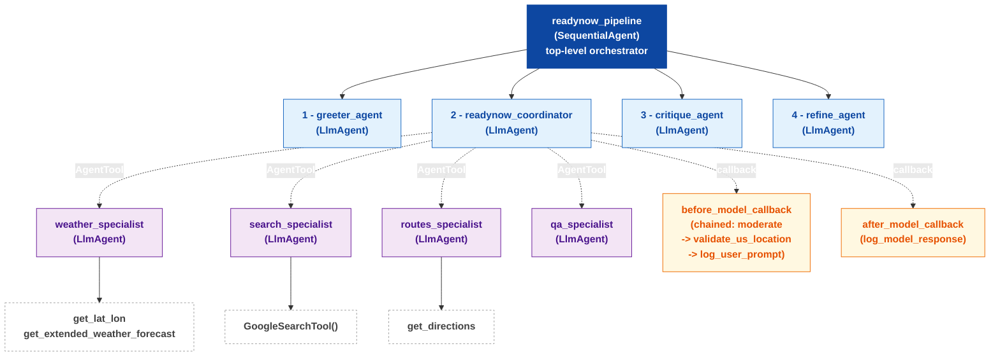
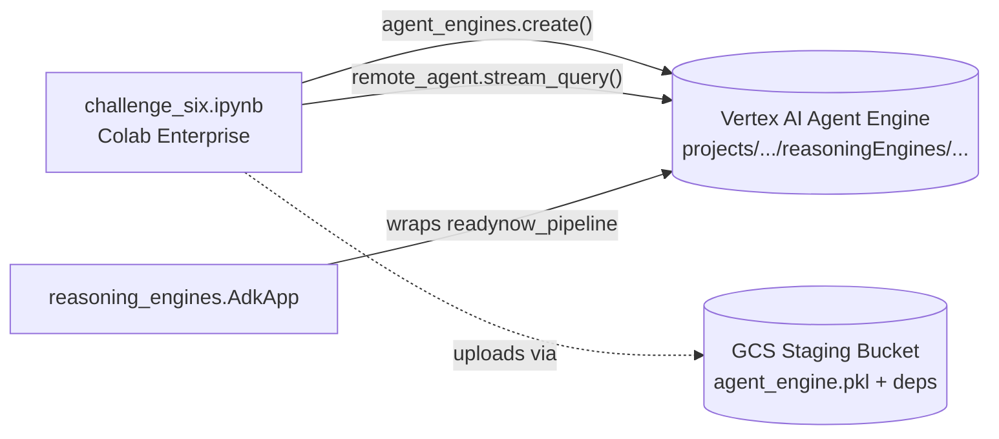

# ReadyNow! Architecture (Challenge 6)

ReadyNow! is the FEMA emergency-preparedness assistant required by Challenge 6
of the workshop. It is built as a deterministic `SequentialAgent` pipeline that
coordinates four specialist agents and applies a validate/refine workflow on
every response.

## High-level diagram

> The diagram below is an **agent hierarchy tree**: it shows the parent/child
> relationships rather than the data flow. The 4 children of `readynow_pipeline`
> are executed sequentially (1 -> 2 -> 3 -> 4), and the 4 children under
> `readynow_coordinator` are AgentTools that can be invoked by the LLM. Solid
> edges are containment, dashed edges are tool invocation.



**Reading the tree**:

- **Solid arrows** = containment (parent -> child sub_agent or agent -> tool)
- **Dashed arrows** = the parent can call the child as an `AgentTool` or has
  it as a callback attached
- The 4 children of `readynow_pipeline` execute in numbered order (1 to 4)
  because the root is a `SequentialAgent`. The 4 children under
  `readynow_coordinator` are invoked on demand by the LLM as tools

## Components

### Top-level pipeline

`readynow_pipeline` is a `SequentialAgent` that runs four stages in order:

1. **greeter_agent** - introduces the assistant and its capabilities
2. **readynow_coordinator** - dispatches the query to the right specialist
3. **critique_agent** - reviews the coordinator's draft answer
4. **refine_agent** - rewrites the answer using the critique

State is propagated between stages through `output_key`:

- `greeter_agent.output_key = "greeting_message"`
- `readynow_coordinator.output_key = "initial_draft"`
- `critique_agent.output_key = "critique_suggestions"`
- `refine_agent.output_key = "final_response"`

The `critique_agent` and `refine_agent` instructions reference `{initial_draft}`
and `{critique_suggestions}` to inject the prior state.

### Specialists (exposed to the coordinator as `AgentTool`s)

| Specialist | Tools | Responsibility |
|---|---|---|
| `weather_specialist` | `get_lat_lon`, `get_extended_weather_forecast` | US weather forecasts (NWS API) |
| `search_specialist` | `GoogleSearchTool()` | Live web search for news / FEMA alerts |
| `routes_specialist` | `get_directions` | Evacuation / travel routes (Google Maps Directions) |
| `qa_specialist` | (none) | General preparedness Q&A |

Using `AgentTool` rather than `sub_agents` keeps the coordinator's output a
coherent textual draft (instead of transferring conversation control), which
is what the downstream critique / refine agents need.

### Cross-cutting callbacks

Attached to the `readynow_coordinator`:

- **before_model_callback** = `chained_before_callback` which runs, in order:
  1. `moderate_user_prompt` - blocks prompt injection / jailbreak attempts
  2. `validate_us_location` - rejects non-US queries (NWS API is US-only)
  3. `log_user_prompt` - records the incoming user message
- **after_model_callback** = `log_model_response` - records the outgoing
  response.

Returning a non-`None` `LlmResponse` from any of the validators short-circuits
the rest of the pipeline and returns the validation error directly to the
user.

### Deployment topology



Local test path:

```
User -> AdkApp.async_stream_query() -> readynow_pipeline -> response
```

Cloud test path:

```
User -> remote_agent.stream_query() -> Vertex AI Agent Engine -> readynow_pipeline -> response
```

## Mapping to FEMA stakeholder requirements

| PDF requirement (slide 72) | Implementation |
|---|---|
| Real-time weather and news alerts | `weather_specialist` + `search_specialist` |
| In the event of a disaster, provide suggested routes to safety | `routes_specialist` (Google Maps Directions) |
| Log all interactions between the user and the agent | `log_user_prompt` + `log_model_response` |
| Validate that user input is appropriate and refuse off-mission requests | `moderate_user_prompt` + coordinator strict-scope instructions |
| Ensure agent responses are valid, well-written, and easy to understand | `critique_agent` -> `refine_agent` sequential workflow |
| Deploy the agent to Agent Platform | `vertexai.agent_engines.create(app_readynow, ...)` |
| Test code that demonstrates the agent's functionality | 6 local test scenarios + 2 remote (cloud) test scenarios |
